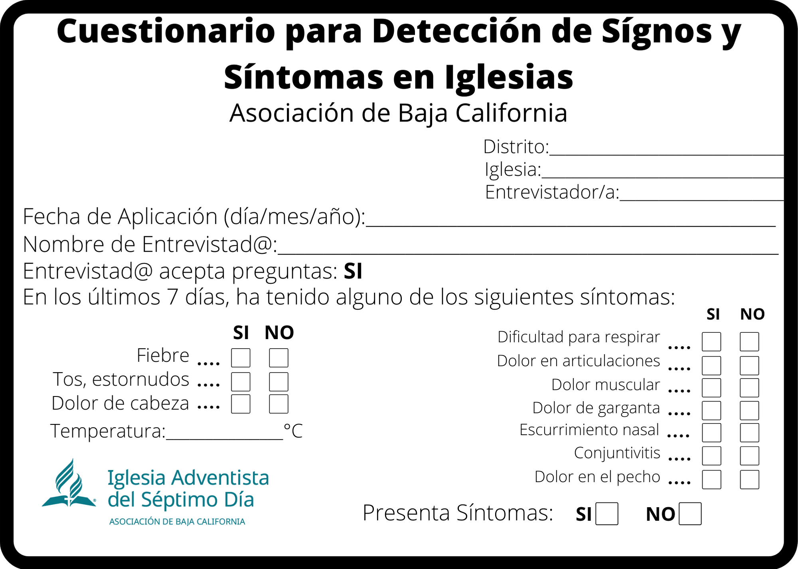
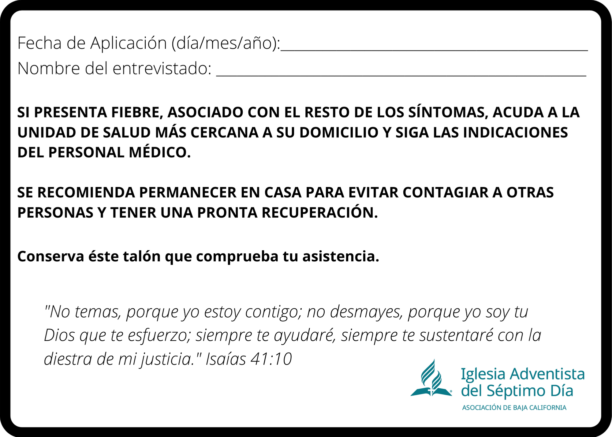
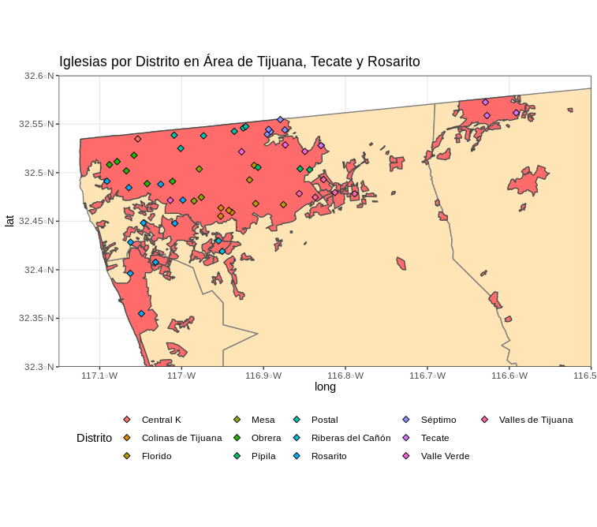
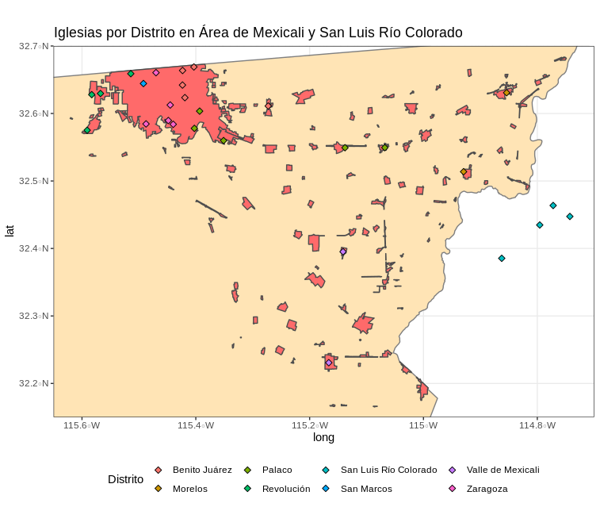
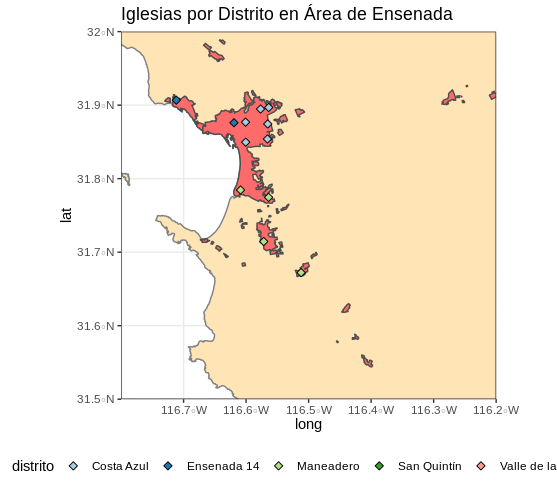
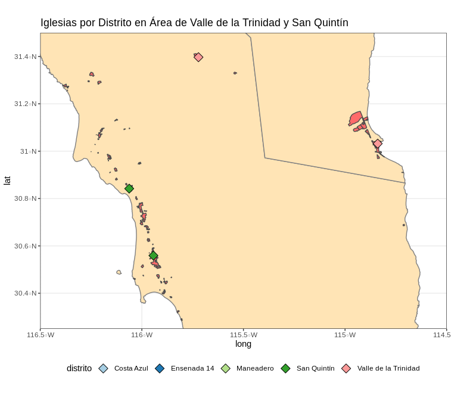

```{r setup, include=FALSE}
knitr::opts_chunk$set(echo = TRUE)
```
Éste documento ha sido compilado utilizando como guía el documentoproporcionado por el Dr. Donatt en la sesión del miércoles 20 de Mayo del 2020, se ha complementado con implementaciones personalizadas para la Asociación de Baja California de los Adventistas del Séptimo Día.

**El filtro sanitario se debe implementar en las fases de semáforo amarillas y verdes en todos los centros de culto.**

## Logística de Actividades:

  1. A la entrada o entradas de cada recinto cerrado deberá delimitarse una zona de recepción con marcas definidas en el piso o barreras.
    - Este Filtro deberá ser atendido por el personal previamente capacitado que se designe.
    - Toda persona que desee entrar al recinto deberá portar correctamente un cubre boca propio, si no lo está portando de manera correcta, se le orientará para que lo corrija.
  1. Tomar la temperatura corporal:
    - Deberá ser tomada a distancia a cada persona con un termómetro digital infrarrojo bien calibrado.
    - Si la persona tiene una temperatura mayor o igual a 38 grados Centígrados, no continuará con los siguientes pasos y no podrá permanecer en el lugar. Recomendándole acudir a una evaluación médica.
    - Si la persona presenta una temperatura corporal menor a 38 grados Centígrados, podrá avanzar al siguiente paso.
    - La temperatura aceptable se deberá anotar en el cuestionario que se entregará a cada persona.
  1. Dentro de la zona marcada como filtro, debe existir:
    - Una charola, bandeja o tapete impregnados o que contengan una solución de Hipoclorito de Sodio para que, al pisarlo, desinfecte la suela de los zapatos.
    - Una toalla de piso seca o tapete absorbente para pisar después del Hipoclorito y secar los excedentes.
    - En su defecto, se le proporcionara a cada persona un par de cubre zapatos para poder continuar.
    - Proporcionar o aplicar a cada persona, gel desinfectante de alcohol al 70% para desinfectar sus manos antes de tocar cualquier otra cosa y a la salida del recinto.
  1. Entregar un boligrafo y una hoja que contenga un cuestionario que indique su estado de salud actual.
    - A continuación se presenta el formato del cuestionario impreso a utilizarse:

<center>
{width=500px}
</center>

<center>
{width=500px}
</center>

## Requerimientos Necesarios

  1. Designar y adiestrar a miembros voluntarios de la Iglesia para atender el filtro sanitario.
    - Pueden participar: profesionales de la salud o personas capacitadas.
    - La capasitación deberá ser proporcionada por profesionales de la salud.
    - Podrán ser capacitados, los Guias Mayores, las Diaconizas, los Diaconos o toda persona que se ofresca como voluntaria y que acredite la capacitación.
  1. Cada persona que atienda el Filtro Sanitario, deberá vestir el siguiente equipo:
    - Bata protectora de tela o desechable.
    - Cubre boca [tricapa](https://www.bypmedical.com.mx/producto/cubrebocas-tricapa-fda/).
    - Lentes de protección y/o Careta de acetato que cubra toda su cara.
    - Guantes de [Latex](https://www.homedepot.com.mx/seguridad/equipo-de-seguridad/guantes/guante-de-latex-desechable-10-piezas-133909) o [Nitrilo](https://www.homedepot.com.mx/seguridad/equipo-de-seguridad/guantes/guante-nitrilo-desechable-107411) o [Polietileno](http://rygsac.com/indumentaria-de-un-solo-uso/alimentario-de-un-solo-uso/guantes-de-polietileno) no esteriles.
  1. La Iglesia deberá proporcionar los Equipos de Protección Personal (EPP), mencionados en el punto anterior, al personal capacitado que atenderá el filtro sanitario.
    - El EPP deberá ser lavable o desechable con excepción de los Googles de protección y/o Caretas de acetato.
  1. Deberá tener una mesa o escritorio cubierto con un paño de tela lavable o plastico desechable. En caso de no disponer de esto, se deberá limpiar la superficie cada 4 horas con una solución diluida de Hipoclorito de Sodio:

<center>
{width=250px}
</center>

  1. Deberá tener sillas para los encargados de aplicar el Filtro Sanitario y estas se ubicarán con un metro y medio de separación entre silla y silla.
  1. Deberá tener una charola, bandeja o tapete impregnados o que contengan una solución de Hipoclorito de Sodio para que, al pisarlo, desinfecte la suela de los zapatos.
    - Una toalla de piso seca o tapete absorbente para pisar después del Hipoclorito y secar los excedentes.
    - En su defecto, se le proporcionara a cada persona un par de cubre zapatos para poder continuar.
  1. Deberá haber agua y jabón o bien gel desinfectante de alcohol al 70% y una solución clorada (Hipoclorito se Sodio) para mantener limpio y desinfectado.
  1. Deberá tener toallas de papel desechables.
  1. Deberá tener un bote para basura con bolsa plástica desechable y con tapa, para los desechos (se deberá evitar la acumulación de los desechos).
  1. Deberá tener un termómetro digital infrarrojo.
  1. Deberá tener suficientes cuestionarios de detección y bolígrafos.
  1. Antes de vestir el EPP se deberá desinfectar las manos con gel de alcohol al 70% o con agua y jabón. 
    - Se deberá colocar de manera correcta el cubre bocas, cubriendo boca y nariz, asegurando que no haya espacios entre su cara y el cubre bocas.
    - Debe evitar tocarse el cubre boca mientras lo usa; si lo hace, deberá lavarse las manos nuevamente.
    - Deberá cambiar el cubre boca tan pronto como esté húmedo y no reutilizarlo si es desechable.
    - Para quitar el cubre boca deberá tomarlo por atrás (nunca por la parte delantera) y depositarlo en un recipiente cerrado, y lavar las manos nuevamente.
    - Si el cubre boca es lavable, deberá lavarlo con agua y jabón después de usarlo y volver a usarlo hasta que esté completamente seco.
    - Recuerda que el uso de cubre bocas no sustituye a las otras medidas de protección.
  1. Después de la colocación del cubre bocas, deberá vestir los demás implementos de protección. 
    - Deberá vestir la bata u overol con gorro.
    - Colocarse los googles de protección y/o la careta de acetato
    - Al final los guantes de látex, o nitrilo, o polietileno.

## Recabado de información e Informes

Se propone recabar el filtro sanitario en el siguiente repositorio en línea:

  - [https://forms.gle/CitYXr1ts8tcvniM8](https://forms.gle/CitYXr1ts8tcvniM8)

Ésto permitirá el análisis en tiempo y forma para la toma de decisiones por parte de los directivos en la Asociación de Baja California que así mejor convengan para afrontar la crisis que representa ésta pandemia.

En colaboración con la adminsitración de la Asociación de Baja California se ha generado también la georeferenciación de las iglesias en los 3 campos de la misma, ésto con el objetivo de presentar análisis apropiados para la toma de decisiones en tiempo cuasi-real. Ofreciendo a los dirigentes una ventaja competitiva _versus_ el uso únicamente de filtros sanitarios en físico.

En los siguientes mapas se muestran las iglesias por distrito y/o área. Se pueden generar visualizaciones por cada distrito o por regiones en particular con los nombres de cada iglesia, se ha evitado hacer ésto de inicio para proteger la privacidad de los datos de las iglesias. Previa solicitud del equipo administrativo de la Asociación de Baja California los datos se pueden desplegar para la toma de decisiones.

### Iglesias Tijuana

<center>
{width=500px}
</center>

No fué posible geolocalizar (encontrar sus coordenadas en google maps) las siguientes iglesias:

  1. Colinas de Tijuana:
    - Centenario.
    - Cuauhtemoc.
    - Los Pinos.
  1. Florido:
    - Los Olivos.
  1. Mesa:
    - Internacional.
  1. Pípila:
    - El Pípila.
    - El Barretal.
  1. Séptimo:
    - Rinconada II.
    - La Frontera.
  1. Valle Verde:
    - Chilpancingo.
  1. Valles de Tijuana:
    - Vistas del Valle.
    - Los Laureles.
    - Los Girasoles.
  1. Central K:
    - Cárdenas.
  1. Postal:
    - Tzotzil.
  1. Riberas del Cañón:
    - La Presa/Los Pinos.
  1. Rosarito:
    - Las Cruces.
    - Xico.
  1. Tecate:
    - Hongo.
    - San Pedro.
    
Será importante tener el apoyo de los pastores locales o la administración central para geolocalizar las iglesias anteriores.

## Iglesias Mexicali y San Luis Río Colorado

<center>
{width=500px}
</center>

No fué posible geolocalizar (encontrar sus coordenadas en google maps) las siguientes iglesias:

  1. Palaco:
    - Monarcas.
    - Venustiano Carranza.
  1. Revolución:
    - Colosio.
  1. San Marcos:
    - Pueblo Nuevo.
    - Fundadores.
  1. Morelos:
    - 5 de Mayo.
    - Ejido Benito Juárez.
    - Ladrillera.
    - Lázaro Cárdenas.
  1. Valle de Mexicali:
    - Ejido Durango.
    - Ejido Veracruz.
    - Ejido Km 57.

## Iglesias Ensenada

<center>
{width=500px}
</center>

No fué posible geolocalizar (encontrar sus coordenadas en google maps) las siguientes iglesias:

  1. Ensenada 14:
    - Loma Linda.
    - Flores Magón.
  1. Maneadero:
    - San Vicente.

## Iglesias San Quintín y Valle de la Trinidad

<center>
{width=500px}
</center>


No fué posible geolocalizar (encontrar sus coordenadas en google maps) las siguientes iglesias:

  1. San Quintín:
    - Zapata.
    - Leandro Valle.
    - El Rosario.
    - Colonet.
  1. Valle de la Trinidad:
    - Héroes de la Independencia.
    - El Oasis.
    - San Matías.